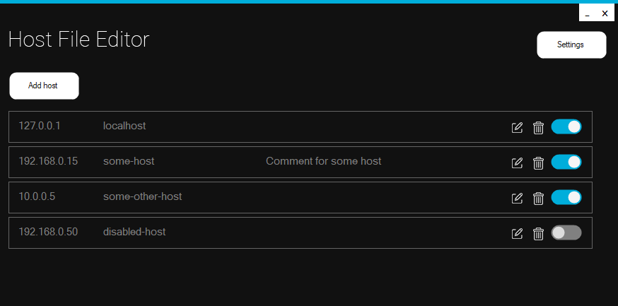

# Hosts-File-Editor

A Windows hosts file editor inspired by [PowerToys Hosts File Editor utility](https://learn.microsoft.com/en-us/windows/powertoys/hosts-file-editor) but less bulky.

## Usage

Extract the executable from the zip-file and run.